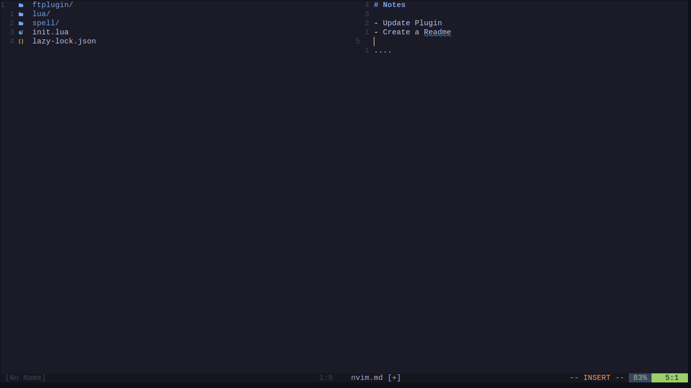

# Notes Neovim

Plugin to maintain separate notes for each project. It creates a markdown file for each project and can be accessed from it.
Notes are stored at ~/nvim-notes.



## Contents

- [Features](#features)
- [Installation](#installation)
- [Contributing](#contributing)

## Features

- Open a markdown file to store Notes of the project.

## Installation

Using [lazy.nvim](https://github.com/folke/lazy.nvim):

```lua
return {
    "Suhaan-Bhandary/notes.nvim",
}
```

Set keymap to open notes:

```lua
-- Notes for each project
vim.api.nvim_set_keymap("n", "<leader>n", "<cmd>lua require(\"notes\").ToggleNotes()<CR>", { noremap = true })
vim.api.nvim_set_keymap("n", "<leader>sn", "<cmd>lua require(\"notes\").ViewAllNotes()<CR>", { noremap = true })
```

## Contributing

Feature and pull requests are welcome.
